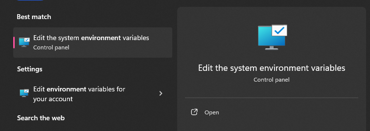
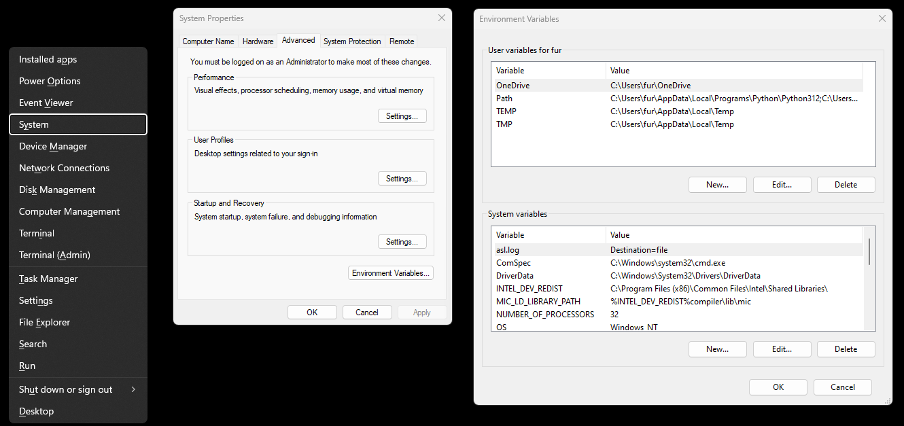
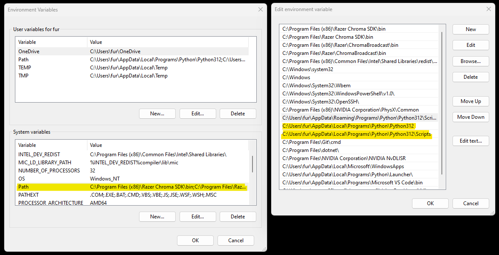
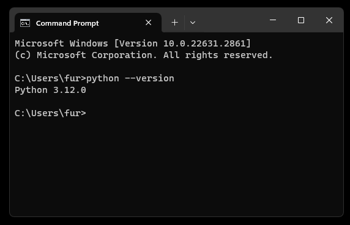

# PMX: PLU, MSG, and Excel File Manager for the LP-Works Program

## 1.) Introduction

This Python program converts files made by and used in the LP-Works program developed by CAS. If you have ever had the displeasure of working with LP-Works, you may have found that the messages (MSG) work in a peculiar way, having a file type of `.msg` instead of a spreadsheet like the PLU files can be imported or exported as.

The key feature of this Python program, titled "PMX" for <ins>**P**</ins>LU, <ins>**M**</ins>SG, and E<ins>**x**</ins>cel, is to convert these .msg files to and from Excel spreadsheet files. Additional features include:

* A way to append the produced converted .msg file Excel spreadsheet to a PLU file spreadsheet (matching the messages to the message number or "MessageNo")
* A PLU spreadsheet g-code sorter (sorts the PLU entries by ascending group code or "GCode" number)
* And a method for converting the older .xls Excel spreadsheet file (what LP-Works uses) to the newer .xlsx Excel file and vise versa (though LP-Works seems to tolerate some .xlsx files)

## 2.) Installation

This program is written in Python, so the Python program will be needed. Install the latest version of Python for your operating system from the [Python downloads page](https://www.python.org/downloads/).

### Windows

On Windows, Python versions 3.7 through 3.12 applications are available on the Microsoft Store as of the date of this Git repo and should suffice in using Python scripts. However, a preferred and more in-depth method for installing Python is below:

Installing with Windows requires the manual addition of Python to the Path system environment variable. It's not important to know what exactly this means, other than this is what will allow your system to actually use Python. To do so, follow these steps:

1. During the installation, note the location where Python is installed. By default, it's usually in a directory like `C:\Users\YourUsername\AppData\Local\Programs\Python\Python3x`, where YourUsername is your Windows username and Python3x is the version number. For example, if my username is 'User123' and my Python version is 3.12, my default directory is `C:\Users\User123\AppData\Local\Programs\Python\Python312`

2. Search "environment variables" in the Windows search in the taskbar and select the option that reads `Edit the system environment variables` or `Edit environment variables for your account` to open the "Environment Variables" window.



* If this doesn't work, follow these steps:
  * Press the Windows key + X on your keyboard to open the Power User menu.
  * Select "System" to open the System Properties window.
  * In the System Properties window, find and click on the "Advanced system settings," then click the "Environment Variables" button.

There will be two sections in the Environment Variables window: The upper one is the user variables, the lower is the system variables.



3. Under the "System variables" section, select the "Path" variable, then double-click it or click the "Edit" button.

4. Add Python Path in the "Edit" environment variable window:
   *
   * Click the "New" button.
   * Paste the path to the Python directory mentioned earlier, as well as the Python subdirectory `\Scripts` inside your Python installation (e.g., `C:\Users\YourUsername\AppData\Local\Programs\Python\Python3x\Scripts`).
   *Click "OK" to close each window.



5. Repeat for the user variables in the upper box

6. Verify installation by opening a new Command Prompt window (you may need to close existing ones for changes to take effect) and type:

```
python --version
```

If Python is correctly added to the PATH, you should see the installed Python version. Now you can run Python commands and scripts from any Command Prompt window.



## 2.) Dependencies

The program, along with Python, requires some Python modules (requirements.txt) to be installed:

```
xlsxwriter
pandas
openpyxl
xlwt
```

In the Command Prompt (which can be opened by pressing the Windows key + 'R', typing 'cmd', and pressing Enter),
type or paste the following and hit enter:

```
pip install xlsxwriter pandas openpyxl xlwt
```

Or you can use requirements.txt like so:

```
pip install -r requirements.txt
```

If this does not install them, check the installation of `pip` and try each module individually:

```
pip install xlsxwriter
pip install pandas
pip install openpyxl
pip install xlwt
```

## 3.) Running pmx.py

Click on the button on the upper right area that says "<> Code" and click "Download ZIP" to download all of the files as one zipped folder. To download just `pmx.py`, click on the `pmx.py` file above or click [here](https://github.com/barfs/LP-Works_PMX/blob/main/pmx.py), then when looking at the page that displays the code, click on the "Download raw file" button in the upper right.

There are several ways to run the program:

* Right click `pmx.py`, hover over "Open with >", and click "Python" if the option is present.

* If that doesn't work, open the folder that contains the `pmx.py` file, right click the folder itself or an empty area in the file explorer, and click the "Open in Terminal" option. Verify the path shown matches the path to the file. For example, if the file is on the desktop, the Powershell window opened may display:

```
Windows PowerShell
Copyright (C) Microsoft Corporation. All rights reserved.

PS C:\Users\UserName\OneDrive\Desktop>
```

Then enter the line below to open the file in Python:

```
python pmx.py
```

* If this also does not work, you can open the Command Prompt, PowerShell, or Git Bash if you have it installed, by searching for it in the taskbar and double-clicking or pressing "open." Then, use the `cd` command to change directory. First, copy the location of the directory that contains pmx.py (top of the Windows File Explorer window), type `cd` into the open terminal window, then paste the copied file path. For example, this PowerShell terminal starts in the C-drive user directory, but the pmx.py file is in a folder in the D-drive, so the cd command is used like so:

```
Windows PowerShell
Copyright (C) Microsoft Corporation. All rights reserved.

PS C:\Users\UserName> cd D:\Code\Python\LP-Works_PMX
D:\Code\Python\LP-Works_PMX>
```

The input used above is `cd D:\Code\Python\LP-Works_PMX`

If there is a directory that contains a space, use quotation marks:

```
Windows PowerShell
Copyright (C) Microsoft Corporation. All rights reserved.

PS C:\Users\UserName> cd "D:\Code\Python Code\LP-Works PMX"
D:\Code\Python Code\LP-Works PMX>
```

The input used above is `cd "D:\Code\Python Code\LP-Works PMX"`

Once in the correct directory, enter the line below to open the file in Python:

```
python pmx.py
```

## 4.) Usage

If pmx.py has been properly opened, the terminal output should look like this:

```
PLU/MSG/Excel Python program started:

Select a task:
1.) Convert .msg file to Excel file
2.) Convert Excel file to .msg file
3.) Append message Excel file to PLU Excel file
4.) Sort PLU Excel by g-code
5.) Convert .xls to .xlsx (Old Excel to New Excel)
6.) Convert .xlsx to .xls (New Excel to Old Excel)
7.) Toggle Debug Mode (Currently set to False)
8.) Get or change directory info
9.) Help
0.) Exit program

Type a number and press 'enter' to select an option: 
```

To pick an task, press a number and press 'enter.'

`Debug Mode` is used for testing purposes and can be ignored.

For more details on each option, use the 'help' command `9`.

If the program freezes or glitches in some way to not allow the exit via the input `0`, use ctrl + c to force quit the program.

Output file names are determined by input file names. For example, `file.msg` converted to an Excel file would become a new file titled `file.xlsx`. If there is a file that exists with the same name in the working directory, the option to overwrite the file or cancel the operation will appear.

## 5.) LP-Works

In LP-Works, you can import and export `.xls` Excel spreadsheet files for PLU information using `File(F) > Data Import > Excel File (*.xls)` and `File(F) > Excel Export`, respectively. The import option can sometimes handle `.xlsx` files as well.

The messages (MSG) does **NOT** have the `File(F) > Excel Export` option, so to export message information, use `File(F) > Save As(A)` and create a file name ending in `.msg`. The MSG section does have the ability to import Excel spreadsheets, but like the PLU section, it relies on the older `.xls` file format, with the potential for compatibility with `.xlsx` files. If you have converted a `.xlsx` file back into a `.msg` file with the program, use `File(F) > Open(O)` and find the `.msg` file to open it in LP-Works.
